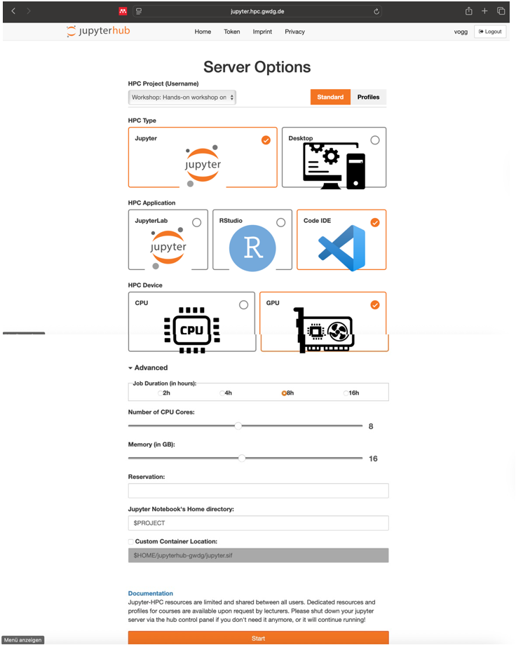
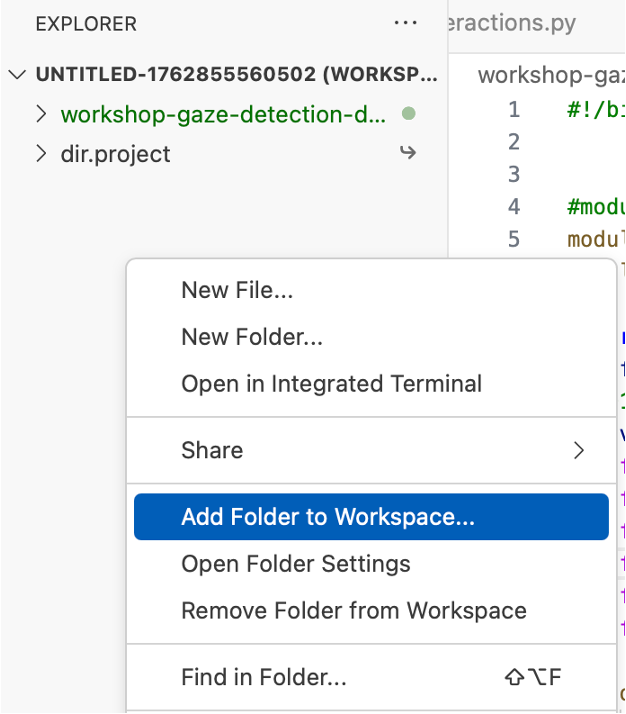
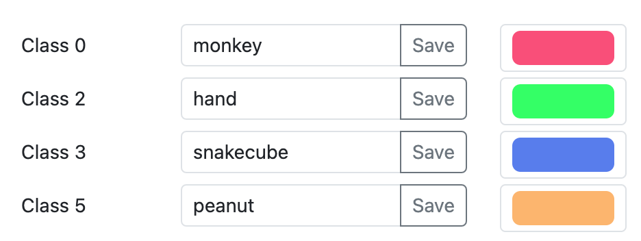
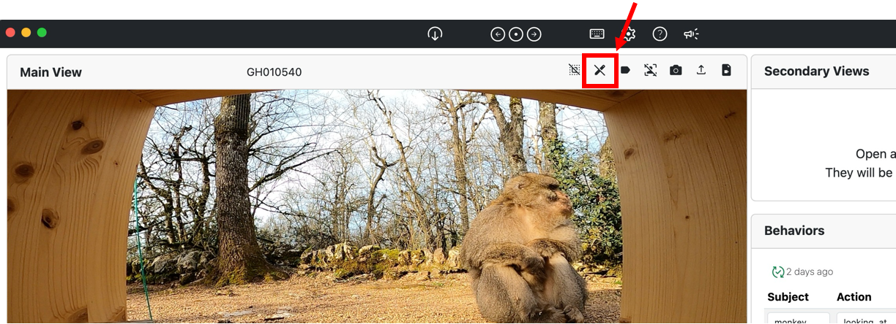
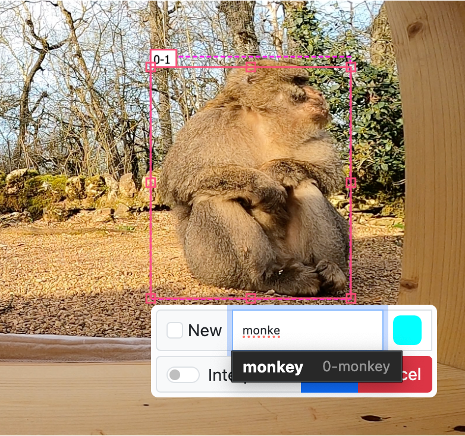
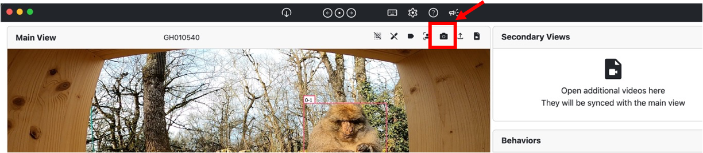
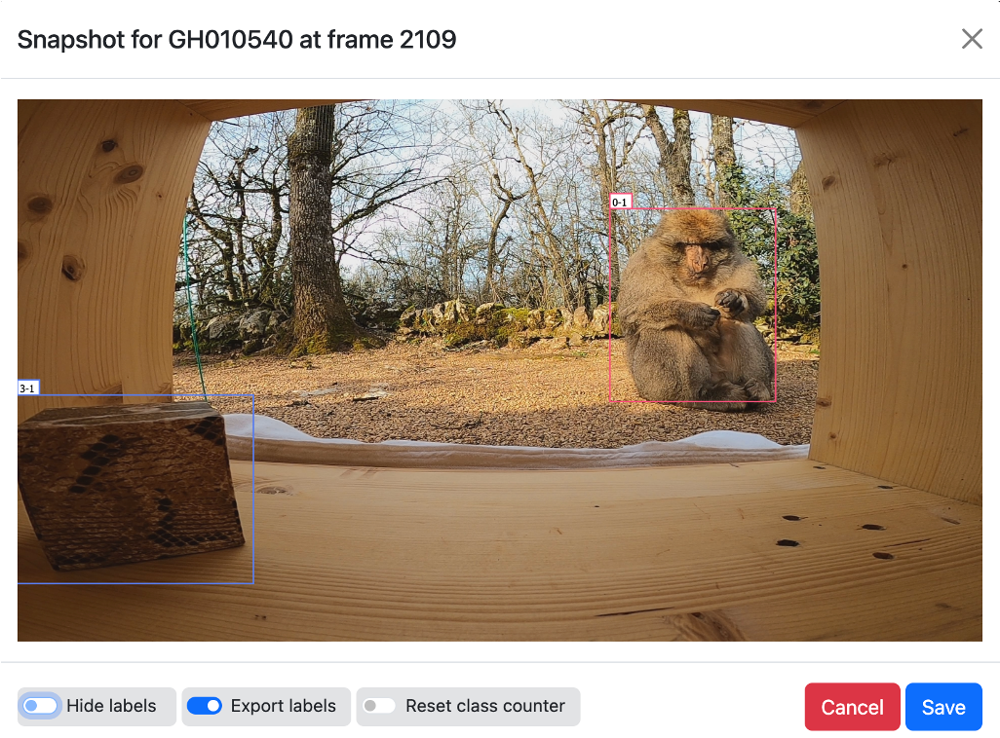
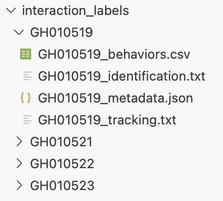
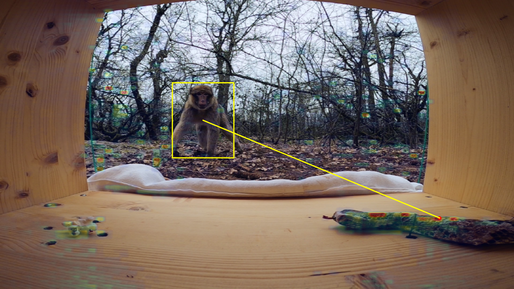

# Hands-on workshop on gaze and interaction detection on videos using deep learning

## Day 1: Multi-animal tracking


### Data & Code preparation

Go to: [jupyter.hpc.gwdg.de](jupyter.hpc.gwdg.de)




Go to your home directory: 
```cd $HOME```
Find out the path with ```realpath .``` (The . is important).

Download the code:
```git clone https://github.com/richardvogg/workshop-gaze-detection-dpz.git```

Go to the project directory:
```cd $PROJECT```

Activate the environment:
```source dpz_workshop/bin/activate```

Make a directory for your data (if it does not exist). Optionally, create subfolders if you need them: 

```mkdir <Your_Name>```

```cd <Your_Name>```

```mkdir videos```

```cd $HOME```

Add both folders $HOME and $PROJECT via their realpaths to your navigation window:




### Frame selection & labeling

Download and install the [Simple Interface for Labeling Video Interactions (SILVI)](https://gitlab.gwdg.de/kanbertay/interaction-labelling-app/-/blob/4bb7eb9d8a810ec5d66c079f589ba8f4e64e0246/README.md).

Input the object classes in "Settings".



Activate the drawing mode.



Repeat the following for 100-500 images:
Navigate to an interesting image (not only easy images, overall as diverse images as possible). Draw bounding boxes around the outermost pixels of each object of interest and select the class.



Take a screenshot.



Activate "Export labels". If you start a new project, activate "Reset class counter" for the first frame. Click "Save" to save the screenshots and annotations.



After annotating enough (at least 100) images, copy both images and labels to your data folder (can be done by drag-and-drop into the navigation sidebar). I renamed my folders to "tracking_images" and "tracking_labels" but that is optional.

### Tracking model training

Open the file ```PriMAT-tracking/data_prep/prepare_labels.py``` via the navigation window on the left and adapt the paths in the file so that they point to your labels folder.

Run ```python PriMAT-tracking/data_prep/prepare_labels.py```.

Open the file ```PriMAT-tracking/src/lib/cfg/experiment_paths.json``` and adapt the paths accordingly.

Open the file ```train_tracking.sh``` and adapt parameters accordingly, probably you will need to change: ```exp_id``` (the name that you give to this experiment), ```reid_cls_names``` (names of the object classes you want to track). Potentially, you can increase ```batch_size``` if your video/image resolution is lower than 1920x1080.

Run ```sh train_tracking.sh```.

Your models will be saved in ```PriMAT-tracking/exp/<exp_id>```

### Inference & evaluation

Open the file ```inference_tracking.sh```. 
The first loop contains the video names of the video you want to apply the model to. Start with one video. Later you can use the current code ```for f in ../.project/dir.project/workshop-data/videos/*.MP4; do``` (or similar) to apply it to all .MP4 files in a folder.
Adapt the parameters: ```load-tracking-model``` should point to your recently trained model file.  Set ```output_format``` to ```video```. The output frames and the output video will be stored in ```<output_root>/<output_name>```. While the model is being applied you can already check the frame outputs and visually inspect them.
If your model is missing detections, decrease ```conf_thres``` or ```det_thres```. 
You can also test several parameters by setting the respective for loop to ```for conf in 0.02 0.04; do```. In this case it makes sense to change the output name, e.g. to ```--output_name "$vid"_"$conf"```.

After you are sufficiently happy with the results on a few manually inspected sequences, you can apply your setting to all videos. In this case it makes sense to change ```output_format``` to ```text``` to save time and space.

## Day 2: Interaction detection

### Interaction labeling

Download your tracking model outputs (.txt files in PriMAT-tracking/videos/(path you specified in ```inference_tracking.sh```)). In case you don't have any, download the ones from $PROJECT/workshop-data/full_videos_with_tracks.

Open videos and tracking outputs in SILVI. Annotate interactions, improve tracks.
Move your label folders to the cluster (via drag-and-drop).



### Interaction model training

Go to your code folder (```cd $HOME/workshop-gaze-detection-dpz```).

Run ```python gazelle/data_prep/convert_SILVI_interactions.py```.

Run ```python gazelle/data_prep/dataset_split.py```.

Run ```python gazelle/data_prep/add_negative_frames.py```.

Before that you can check what is in those files and potentially adapt paths.

Open ```train_interactions.py``` and adapt the paths.

Run ```python train_interactions.py```. 

### Inference

Open ```inference_interactions.py``` and adapt the paths.

Run ```python inference_interactions.py```.




Your output is in gazelle/output_images/<videoname>.
If you want to convert it to a video, run:

```cd gazelle/output_images/<videoname>```

```module load ffmpeg```

```folder_name=$(basename "$PWD")```

```ffmpeg -framerate 6 -pattern_type glob -i "frame_*.png" -c:v h264_nvenc -pix_fmt yuv420p "../${folder_name}.mp4"```

